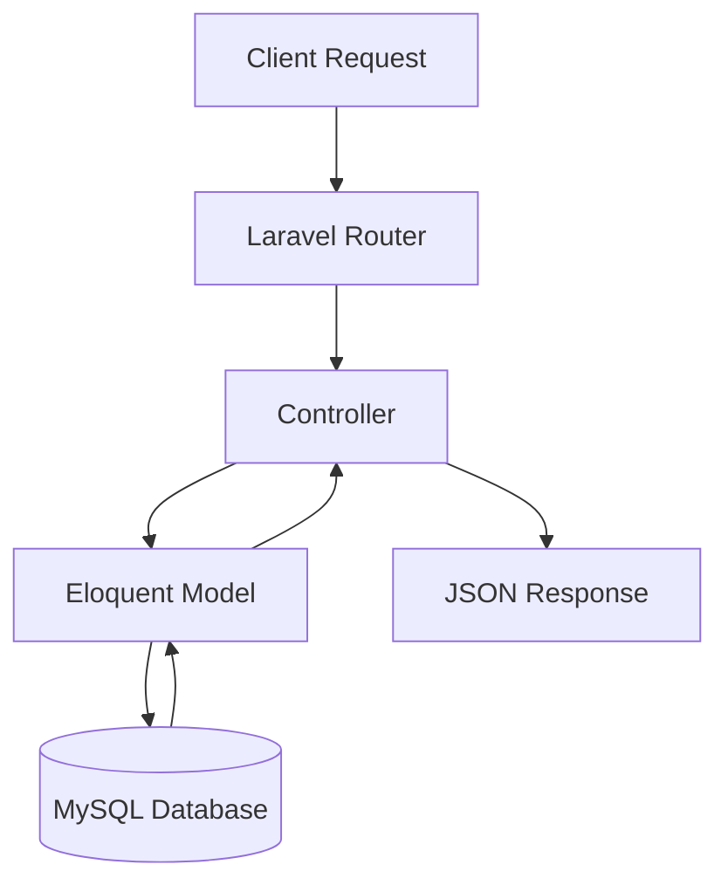
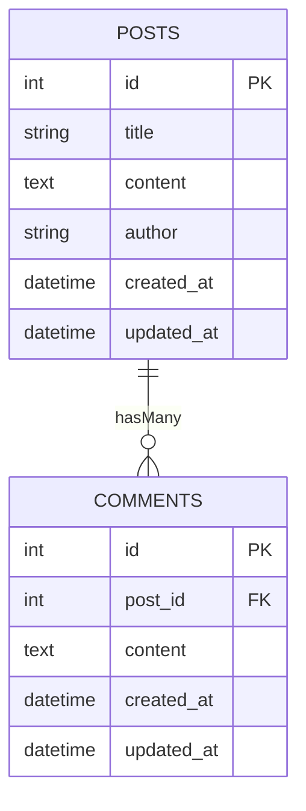

# fastview-pre-employment-assignment
패스트뷰 라라벨 사전 과제 - 게시판 API 개발

## Name
fastview-pre-employment-assignment

## Description
이 프로젝트는 Laravel 10 이상과 PHP 8.1+ 환경에서 동작하는 게시판 API를 구현하는 사전 과제입니다.
CRUD 기본기, 데이터베이스 모델링, API 문서 작성 능력을 확인하는 것이 목적입니다.

구현 범위:
- 게시글(Post) CRUD
- 댓글(Comment) CRUD (Optional)
- 페이지네이션
- 요청 데이터 유효성 검사
- 공통 JSON 응답 포맷 적용

## Badges


## Visuals
게시판 API 처리 흐름 예시:


Database ERD:


## Installation

### Requirements
- PHP 8.2+
- Docker

### Steps
```bash
# 1. 저장소 클론
git clone https://github.com/jonghyun-cheong/fastview-pre-employment-assignment.git
cd fastview-pre-employment-assignment

# 2. 의존성 설치
composer install

# 3. 환경 설정
cp .env.example .env
php artisan key:generate

# 4. 데이터베이스 컨테이너 실행
php artisan docker:run-mysql

# 5. 데이터베이스 마이그레이션 및 시더 실행
# ** 데이터베이스 컨테이너 실행 후 MySQL 초기화에 다소 시간이 걸리므로, 명령 오류 발생시 30초 후 다시 시도해 보세요. ** 
php artisan migrate --seed

# 6. 서버 실행
php artisan serve
```

### Usage (Postman Collection)
- baseUrl : http://localhost:8000
- `postman/collection.json` 에 API 테스트를 위한 Postman Collection 이 포함됩니다.

### Submission
- GitHub Repository 에 코드 업로드
- README.md 에 설치 및 실행 방법 기재
- Postman Collection (JSON) 포함
- 제출 기한 : 과제 수령일로부터 24시간 이내, 자정(24:00)까지

### Evaluation Criteria
- 코드 가독성 구조
- Eloquant 관계 활용
- Validation 처리
- API 문서 완성도
- Git commit 이력
